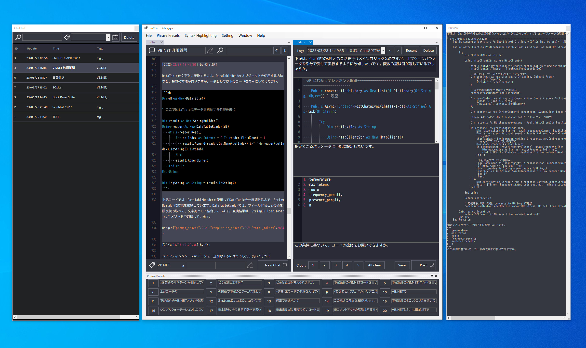

------------------------

# TmCGPT Debugger

------------------------

This application is a developer-oriented Chat GPT API client designed to assist with program debugging. To use it, you must enter your API key in the appsettings.json file.

for Windows 10

// Features:

- Consists of a vertically split main editor, preview screen, chat screen, and chat list screen
- Supports syntax highlighting for various programming languages
- 20 preset phrase buttons & presets (saved in text files)
- Automatic logging of input text and chat
- Full-text search using a database
- API parameter configuration

// How to use:

No installation is required. Please launch TmCGPTE.exe.
It's a simple software, so there should be no confusion, but we'll provide a brief explanation of keyboard shortcuts.

- Ctrl + numeric keypad 1-9, 0 correspond to preset phrases 1-10.
- Alt + numeric keypad 1-9, 0 correspond to preset phrases 11-20.
- Ctrl + Enter key to send text.
- Ctrl + S to save the text only.
- Also, you can zoom in and out the font with Ctrl + mouse wheel rotation.

https://note.com/junmurakami/

I plan to use the above note or Twitter for tool updates and announcements. Although it may be difficult to provide support or respond to requests, please let me know if you notice anything. I also plan to make a Mac version at some point.

2023.3.29 Jun Murakami